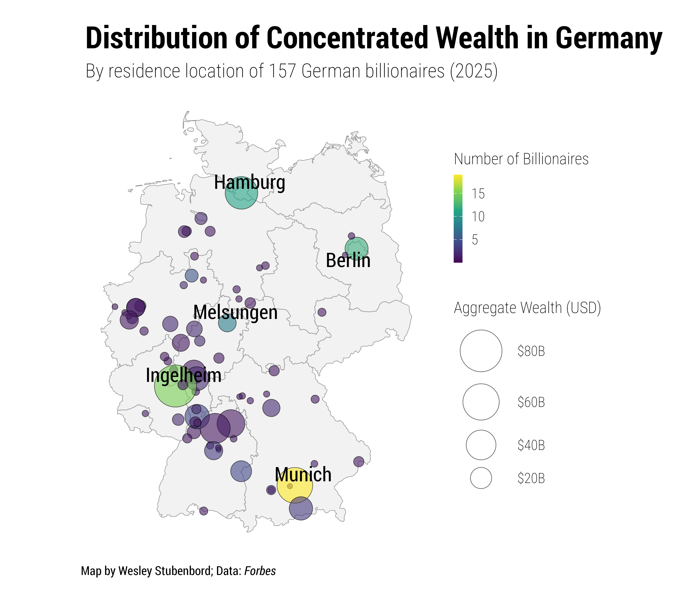

# Geographic Distribution of German Billionaires
An R-based ggplot2 visualization of the geographic distribution of German billionaires and their wealth.  The data source is *Forbes*' 2025 *World's Billionaires* list and is at the city-level based on residence location.  

See here for the blog post: https://wesleystubenbord.com/blog/2025/10/mapping-german-billionaires/

Note: You may run into problems if you don't have the Roboto Condensed font family installed or Roboto Condensed Light registered as a [variant](https://systemfonts.r-lib.org/reference/register_variant.html). Removing those font specifications should solve any problems.

© 2025 Wesley Stubenbord. Licensed under CC BY-NC 4.0.
Free for non-commercial and educational use with attribution.
https://creativecommons.org/licenses/by-nc/4.0/
